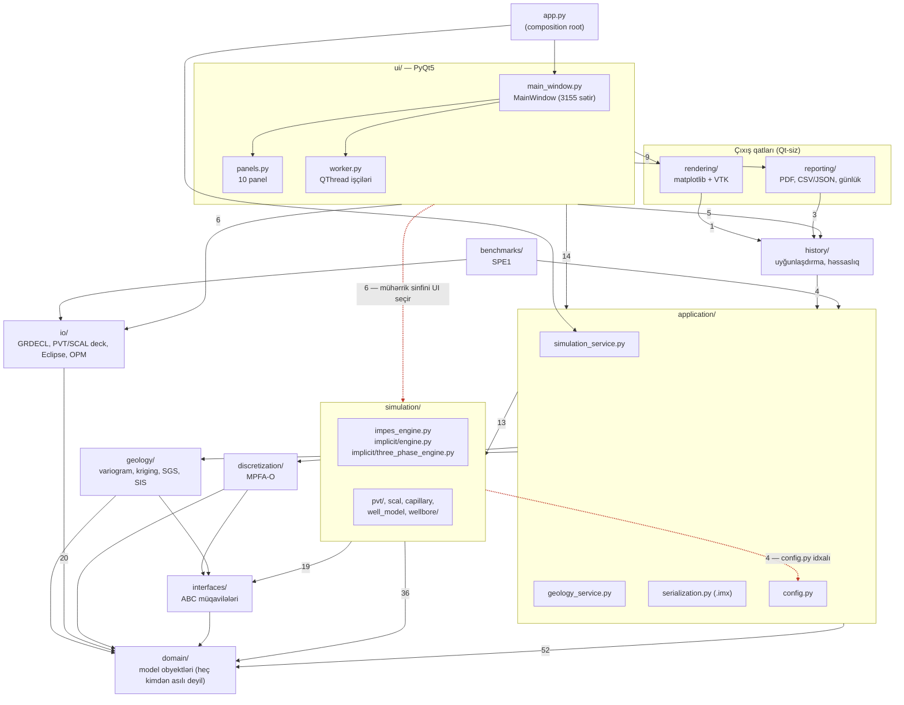

# Diaqram 1 — Qatlı arxitektura və FAKTİKİ asılılıqlar

**Mənbə:** `ARCHITECTURE.md` §2 (nəzərdə tutulan qaydalar) və 2026-09-26
tarixində `imex2d/` paketinin bütün `import` sətirlərinin AST ilə sayılması
(bax `PROJECT_ANALYSIS.md` §4.3). Oxların üstündəki rəqəm — neçə import
sətri olduğu.

Qırmızı oxlar sənədləşdirilmiş istiqaməti («həmişə içəriyə doğru») POZUR.

## Qeydlər

- **`simulation → application` (4 sətir):** `impes_engine.py:17`,
  `linear_solver.py:14`, `implicit/engine.py:18` və üç fazalı mühərrik
  `application/config.py`-dən `SimulationConfig`/`LinearSolverConfig`
  idxal edir. `application` isə `simulation`-dan idxal edir — iki paket
  arasında dövri asılılıq yaranır. Python bunu işlədir (modul səviyyəsində
  dövr yoxdur), lakin sənəddəki qayda formal pozulur.
- **`ui → simulation` (6 sətir):** `main_window.py` `FullyImplicitEngine` və
  `ImpesEngine` siniflərini birbaşa idxal edib `service.with_engine(...)`-ə
  ötürür (`main_window.py:2120-2123`). Mühərrik seçimi composition root-da
  deyil, UI-dədir.
- `domain/` heç bir yuxarı qatı idxal etmir — sənədləşdirilmiş qayda burada
  tam qorunur.
</content>
</invoke>
