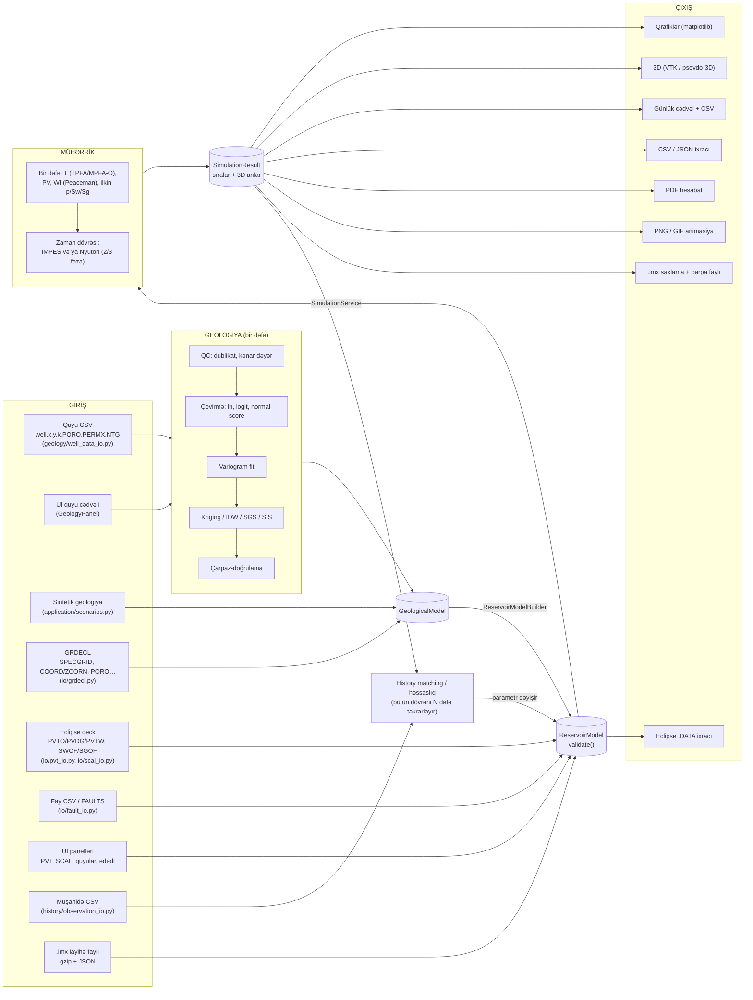

# Diaqram 2 — Ümumi məlumat axını: girişdən nəticəyə

**Mənbə:** `imex2d/application/geology_service.py:441`,
`imex2d/application/model_builder.py:30`,
`imex2d/application/simulation_service.py:262-271`,
`imex2d/application/serialization.py:367-393`, `docs/is_axini_ardicilligi.md` §0.

</content>
</invoke>
