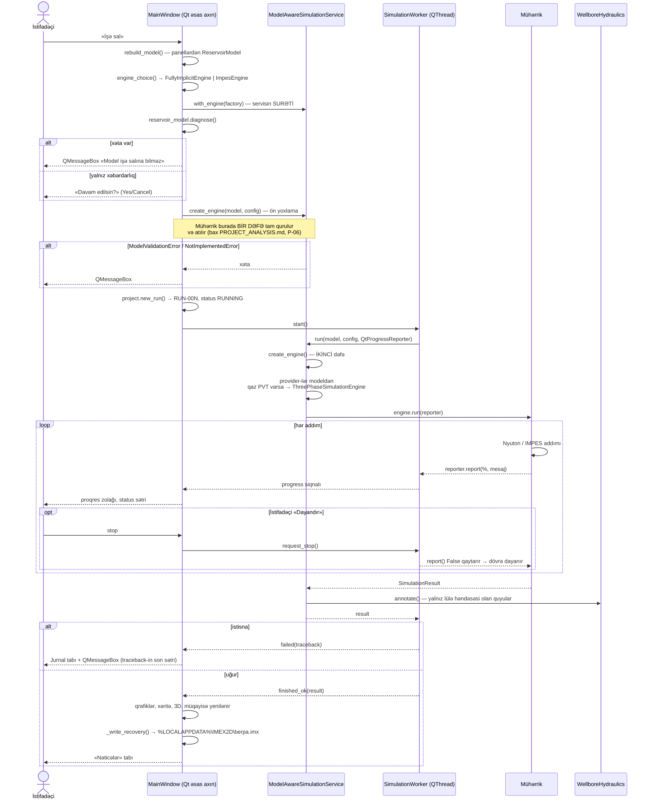

# Diaqram 3 — «Simulyasiyanı işə sal» düyməsindən nəticəyə (ardıcıllıq)

**Mənbə:** `imex2d/ui/main_window.py:2115-2218`,
`imex2d/ui/worker.py:100-124`,
`imex2d/application/simulation_service.py:75-110, 205-227, 262-341`.

</content>
</invoke>
