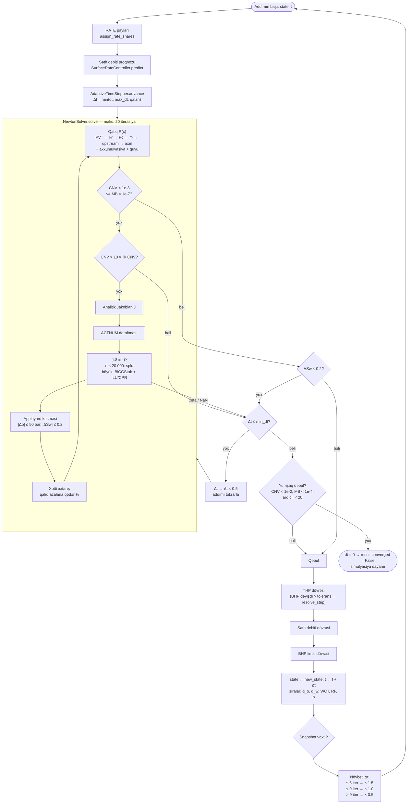

# Diaqram 4 — Tam implicit mühərrikdə bir zaman addımı və Nyuton dövrəsi

**Mənbə:** `imex2d/simulation/implicit/engine.py:192-271`,
`imex2d/simulation/implicit/time_stepping.py:118-201`,
`imex2d/simulation/implicit/newton.py:181-248`,
`imex2d/simulation/implicit/linear.py:59-90`.
Ətraflı mətn izahı: `docs/is_axini_ardicilligi.md` §4.

</content>
</invoke>
