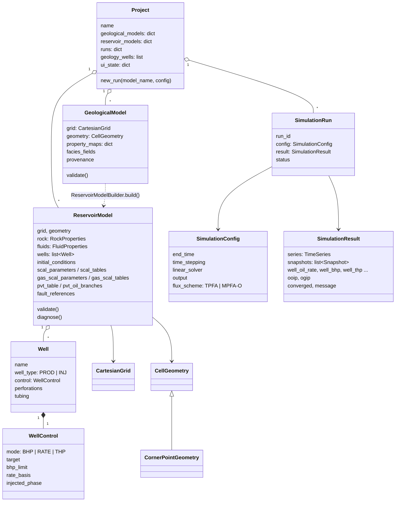

# Diaqram 5 — Əsas domain obyektləri (sinif diaqramı, sadələşdirilmiş)

**Mənbə:** `imex2d/application/project.py`, `imex2d/domain/reservoir_model.py:32`,
`imex2d/domain/geological_model.py:63`, `imex2d/domain/wells.py`,
`imex2d/simulation/results.py`. Yalnız əsas sahələr göstərilib.

</content>
</invoke>
